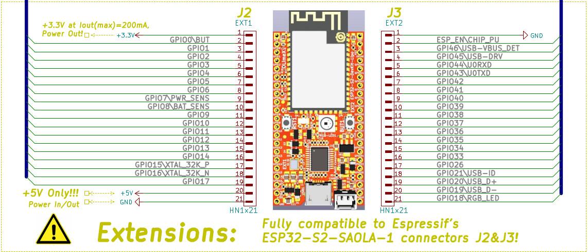

# ESP32-S2 Demo

## Pinout


## Github repo for board
[ESP32-S2-DevKit-LiPo](https://github.com/OLIMEX/ESP32-S2-DevKit-LiPo)

## Tasks

- ### Cloud
    - MQTT upload data
    - OTA
- ### Peripherals
    - ~~ADC~~
    - SPI
    - ~~I2C~~
    - WIFI
    - GPIO
        - ~~Input~~
        - ~~Output~~
    - Interrupt
    - DMA
    - UART
    - Timer
- ### General
    - Unit tests
    - Multi-Threading
    - CLI
    - FreeRTOS
- ### IC's
    - ~~SX1509~~
    - ws2812
        - [ws2812 timer driver](https://crates.io/crates/ws2812-timer-delay)

```
export RUST_ESP32_STD_DEMO_WIFI_SSID='yourSSID'
export RUST_ESP32_STD_DEMO_WIFI_PASS='yourPASS'
cargo build
espflash /dev/ttyUSB0 target/xtensa-esp32s2-espidf/debug/s2-demo
espmonitor /dev/ttyACM0
```